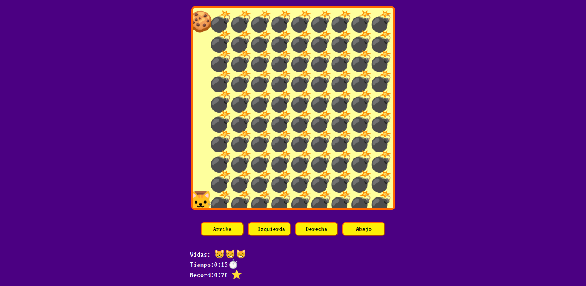

# Javascript Game

Un pequeño juego, armado con Html, css, javascript y canvas.

## Objetivo

El objetivo del juego es que el gato alcanze las galleta a lo largo de los niveles, evitando tocar las bombas, se guarda el record automaticamente para poder superarlo a futuro.

## Funcionamiento 

En desktop pudes mover al gato con las teclas w (arriba), a (derecha), s(abajo), d(derecha), en la versión mobile, el gato se mueve con los botones en pantalla.

